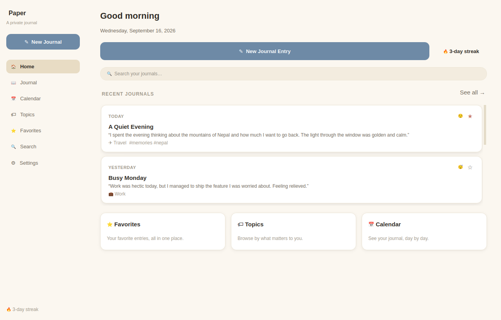
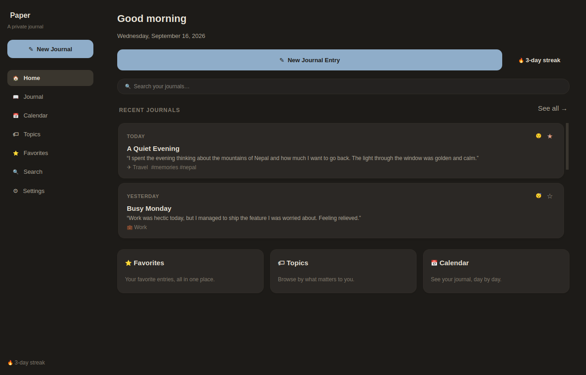
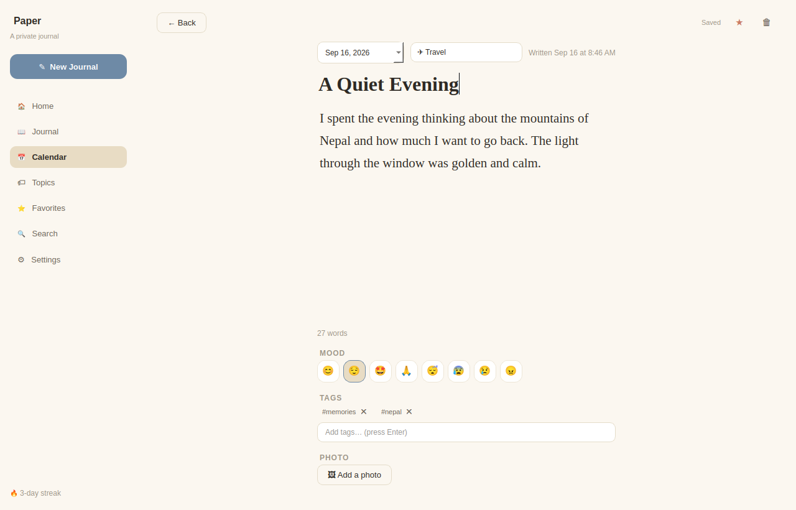
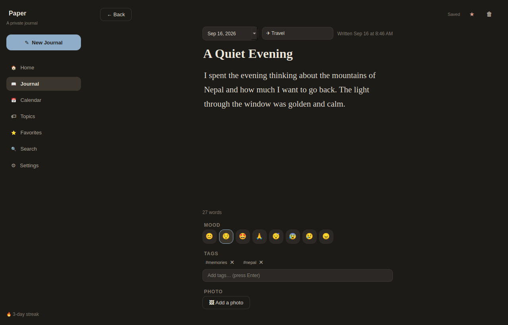
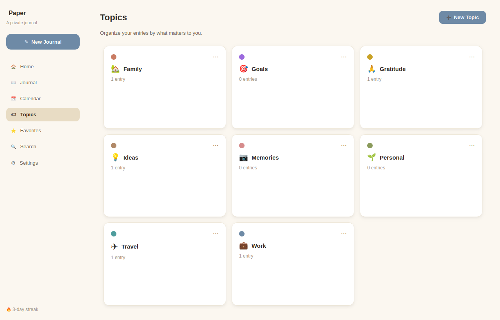
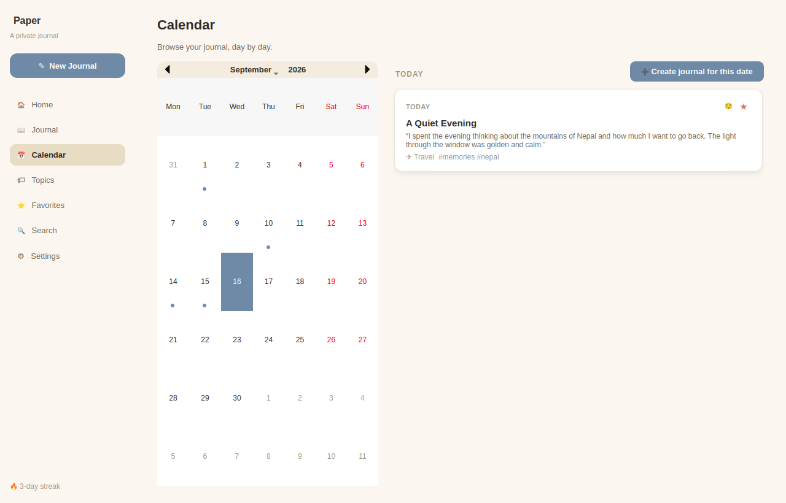

# Paper — A Private Journal

A premium, local-first journaling app for the desktop. Built with **Python, PySide6 (Qt),
and SQLite**, designed to feel like a personal digital diary rather than a database
front-end.

Everything you write stays on your machine. Nothing is uploaded, synced, or sent
anywhere unless you explicitly export or back it up yourself.

|                                   |                                  |
| --------------------------------- | -------------------------------- |
|  |  |
|        |        |
|        |        |

## Features

- **Distraction-free editor** with a large serif reading font, generous margins, a
  centered writing column, and silent autosave (a subtle "Saving… / Saved" indicator —
  never a dialog, never a spinner).
- **Organize your way**: custom topics with colors and icons, free-form `#tags`,
  optional mood, and one-tap favorites.
- **Calendar view** with a small dot marking every day you've written, so you can browse
  your journal the way you remember your life — day by day.
- **Fast local search** across titles, content, topics, and tags, with filters for date,
  topic, mood, and favorites.
- **Two real themes**: a warm "paper" light theme and a properly-designed dark theme
  (not just an inverted palette) — both tuned for long writing sessions.
- **Typography controls**: adjustable journal font size and line spacing; the app
  automatically picks the best available serif/sans fonts on your system.
- **Export** your journal to JSON, Markdown, plain text, or PDF. **Backup** the raw
  database any time using SQLite's own safe backup API (never a mid-write copy).
- **Optional photos** per entry, stored locally alongside your database.
- Meaningful **empty states** everywhere — no dead-end blank screens.
- Friendly error handling — a bug will never show you a raw Python traceback.

## Tech stack

- **Python 3.12+**
- **PySide6 (Qt 6)** for the desktop UI
- **SQLite** for local storage, via **SQLAlchemy 2.x** as the ORM layer
- **reportlab** for PDF export (optional — the app works fine without it; PDF export
  is simply disabled)
- **pytest** for the test suite

## Getting started

```bash
# From the project root
pip install -r requirements.txt
python main.py
```

That's it — the app creates its own local data directory on first run (see
[Where your data lives](#where-your-data-lives) below) and seeds a handful of starter
topics.

### Running the tests

```bash
pip install -r requirements.txt
pytest tests/ -v
```

The test suite (59 tests) covers the database layer, and every service — journals,
topics, tags, search, export, and settings — using an isolated temp data directory per
test, so it never touches your real journal.

## Project structure

```
journal_app/
├── main.py                    # Entry point
├── requirements.txt
├── README.md
│
├── app/
│   ├── config/                 # Paths, constants (default topics, moods, fonts)
│   ├── models/                 # SQLAlchemy ORM models
│   ├── database/                # Engine/session bootstrap, backup
│   ├── services/                # Business logic (journals, topics, tags,
│   │                             #  search, export, settings) — returns DTOs,
│   │                             #  never raw ORM objects, to the UI layer
│   ├── ui/
│   │   ├── context.py           # AppContext: shared services + cross-widget signals
│   │   ├── main_window.py       # Sidebar + page navigation + toast layer
│   │   ├── styles/               # Theme tokens, QSS builder, font resolver
│   │   ├── widgets/              # Dashboard, Editor, Calendar, Topics, Search,
│   │   │                         #  Favorites, Settings, and reusable components
│   │   │                         #  (journal card, topic card, mood/tag selectors,
│   │   │                         #  toast, empty state)
│   │   └── dialogs/              # Confirm, topic editor, export format picker
│   └── utils/                    # Date grouping/streaks, icon glyphs, time helper
│
├── tests/                        # pytest suite, one isolated fixture per test
└── data/                         # (created at runtime; gitignored)
```

This follows a simple clean-architecture split: **UI → services → database/models**.
The UI layer never touches SQLAlchemy sessions directly — every service method opens a
short-lived transaction and hands back plain dataclasses (`JournalDTO`, `TopicDTO`,
`TagDTO`), so nothing in `app/ui/` can crash on a detached ORM instance, and the
persistence layer could be swapped out without touching a single widget.

## Where your data lives

By default, the app stores everything under a per-OS user data directory:

- **Linux**: `$XDG_DATA_HOME/PremiumJournal` (usually `~/.local/share/PremiumJournal`)
- **macOS**: `~/Library/Application Support/PremiumJournal`
- **Windows**: `%APPDATA%\PremiumJournal`

Inside that folder:

- `journal.db` — your SQLite database
- `settings.json` — your preferences (theme, fonts, defaults)
- `media/` — photos you attach to entries
- `backups/` and `exports/` — default destinations offered by the Backup/Export dialogs
- `app.log` — technical logs for debugging (journal *content* is never logged)

You can point the app at a different data directory (useful for testing, or running a
portable copy) by setting the `JOURNAL_APP_DATA_DIR` environment variable before
launch.

## Design notes

- **Autosave, not save buttons.** Every field in the editor — title, content, topic,
  mood, tags, date, favorite — debounces into a single save roughly a second after you
  stop interacting. A brand-new, untouched entry is never written to disk, so opening
  the editor "just to look" never leaves a ghost row behind.
- **Search** currently uses indexed `LIKE` queries rather than SQLite FTS5, which is
  simple and plenty fast for a personal journal (thousands, not millions, of entries).
  If that ever changes, it's isolated to `app/services/search_service.py`.
- **Privacy first.** The app makes no network requests. Journal content is never
  written to the log file. If you ever add encryption, do it with an established
  library (e.g. `cryptography`) rather than rolling your own — the codebase doesn't
  currently implement encryption at rest, since that's a meaningful security surface
  best added deliberately, with real key management, rather than bolted on.

## Possible next steps

A few things intentionally left out of this first version, in case you want to extend
it:

- Full-text search via SQLite FTS5 for larger journals
- Multi-profile / multi-user support (the `User` table is already there for it)
- OS-level notifications for the daily reminder (currently a soft, in-app setting)
- Encryption at rest
- Rich text / markdown formatting in entries
